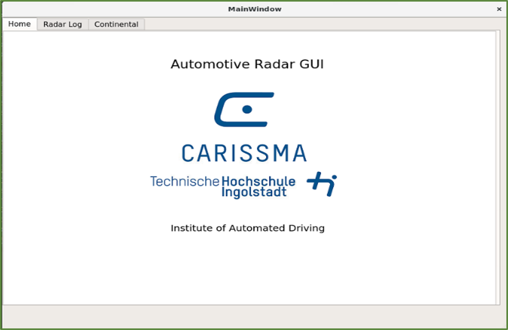
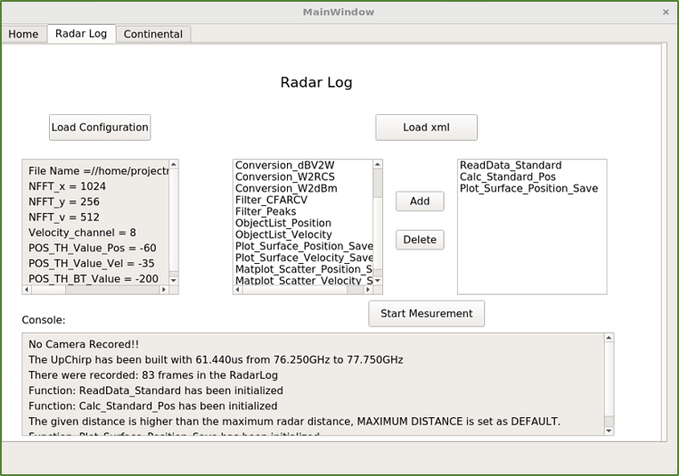
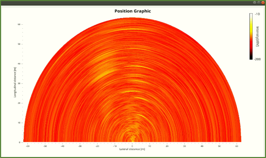
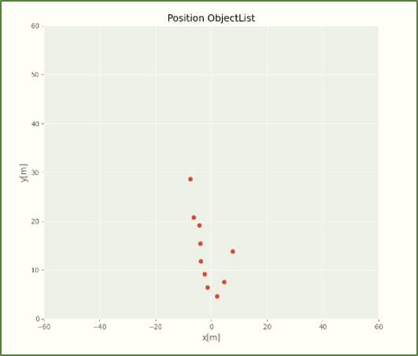

# Automotive Radar GUI for Filtering and Image Construction

## Objectives
- Development of a software to process and visualize both simulated and real radar data. The Software should be written in Python and run in real time.

## GUI Layout
- Home

- Measurement

- Output

