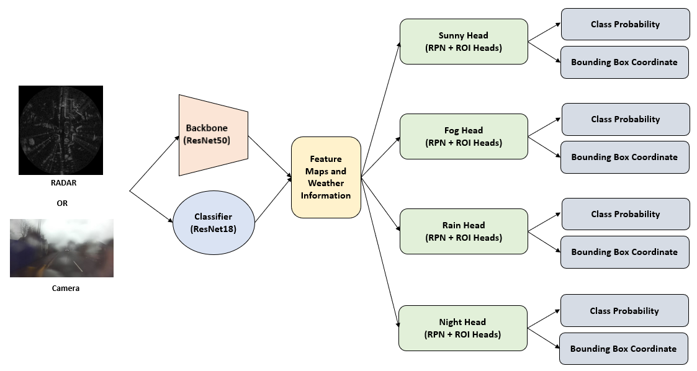
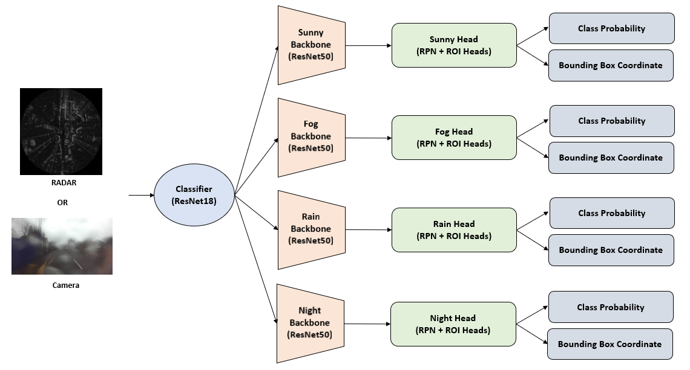

# Comparison of camera-based and radar-based vehicle detection using the RADIATE dataset

## Objectives
- Discussion on how multiple backbones affect the performance by comparing the architecture with a single backbone trained by all weather data 
to the architecture with multiple backbones trained by each specific weather data in the two-stage detector.
- Performance analysis of camera-based and radar-based vehicle detection using the RADIATE dataset under severe weather conditions.

## Suggested Methods
- Ex2

- Ex3
